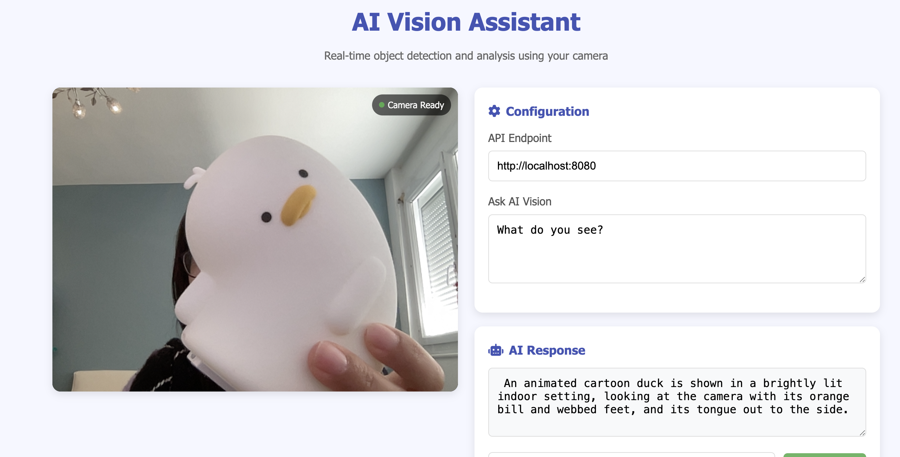

#  Realtime object detection

This repository is a simple demo for how to use llama.cpp server to get real-time object detection

## How to setup

1. Install [llama.cpp](https://github.com/ggml-org/llama.cpp)
2. Run `llama-server -hf ggml-org/SmolVLM-500M-Instruct-GGUF`  
   Note: you may need to add `-ngl 99` to enable GPU (if you are using NVidia/AMD/Intel GPU)  
   Note (2): You can also try other models [here](https://github.com/ggml-org/llama.cpp/blob/master/docs/multimodal.md)
3. Open `index.html`
4. Optionally change the instruction (for example, make it returns JSON)
5. Click on "Start" and enjoy

## Output

## Baseline reference
- [Vintern 1B demo realtime](https://github.com/ngxson/vintern-realtime-demo)
- [SmolVLM](https://github.com/ngxson/smolvlm-realtime-webcam)

## Todo
- [ ] Realtime object detection in French